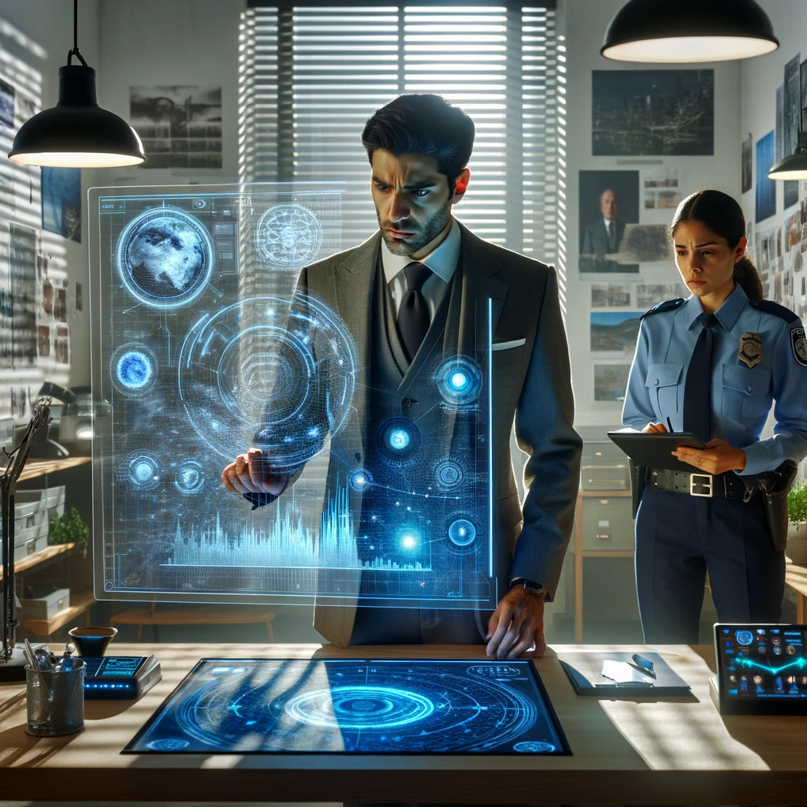

class: center, top

# Other Side

The urban legends world with an open future which displays our fears, hopes, and fantasies in all their glory.

---
class: center, top

## Our time / nearest future

---
class: center, top

## Open future

    
    

---
class: center, top

## Slightly Hyperbolic

Hate is deeper, friendship is stronger, colors are brighter.

    
    
    

---
class: center, top

## Science & Paranormal change people

    
    
    

---

### References

- `[video series]` X-Files  <small>Without aliens</small>
- `[video series][comics]` Marvel's Netflix television series  <small>Jessica Jones, Daredevil, The Punisher</small>
- `[video series]` Gotham TV series
- `[anime series]` Otherside Picnic
- `[video series][comics]` Happy!
- `[video series][book]` American Gods
- `[video series]` Fringe
- `[video series]` Misfits
- `[video series][comics]` S.H.I.E.L.D.
- `[video game]` Control

#### To research

- `[video game]` Stranger Things
- `[anime series][movie][manga]` Ghost in the Shell
- `[video game]` Deus Ex
- `[video game]` Alan Wake
- `[movie]` Unbreakable

---

## Heroes

### Investigator
Journalist, detective, special agent, advocate, lawyer.

- [Fox Mulder](https://en.wikipedia.org/wiki/Fox_Mulder)
- [Dana Scully](https://en.wikipedia.org/wiki/Dana_Scully)
- [Jessica Jones](https://en.wikipedia.org/wiki/Jessica_Jones)
- [Jim Gordon](https://en.wikipedia.org/wiki/Jim_Gordon_(character))
- [Harvey Bullock](https://en.wikipedia.org/wiki/Harvey_Bullock_(character))
- Nick Sax (Happy!)

---

### Low-grade hero/villain
Mutants, psychic.

- [Daredevil](https://en.wikipedia.org/wiki/Daredevil_(Marvel_Comics_character))
- [Harley Quinn](https://en.wikipedia.org/wiki/Harley_Quinn)
- [Punisher](https://en.wikipedia.org/wiki/Punisher)
- Shadow Moon (American Gods)

---

### Adventurer/freelancer

- [The Lone Gunmen](https://en.wikipedia.org/wiki/The_Lone_Gunmen) (X-Files)
- [Iron Fist](https://en.wikipedia.org/wiki/Iron_Fist_(character))
- [Selina Kyle](https://en.wikipedia.org/wiki/Selina_Kyle_(Gotham_character))
- Sorawo Kamikoshi (Otherside Picnic)

---

### Mentor/experienced leader

- [Phil Coulson](https://en.wikipedia.org/wiki/Phil_Coulson)
- [Walter Skinner](https://en.wikipedia.org/wiki/Walter_Skinner)
- [Alfred Pennyworth](https://en.wikipedia.org/wiki/Alfred_Pennyworth)

---

### Puppeteer

- [Smoking Man](https://en.wikipedia.org/wiki/Cigarette_Smoking_Man)
- [Riddler](https://en.wikipedia.org/wiki/Riddler)
- [Raymond Reddington](https://en.wikipedia.org/wiki/List_of_The_Blacklist_characters#Raymond_Reddington)
- Mr. Wednesday (American Gods)
- [Ra's al Ghul](https://en.wikipedia.org/wiki/Ra%27s_al_Ghul)
- [Purple Man](https://en.wikipedia.org/wiki/Purple_Man)

---

### Scientist/engineer/mechanic specialized in paranormal

- [Walter Bishop](https://en.wikipedia.org/wiki/Walter_Bishop_(Fringe))
- [Leo Fitz](https://en.wikipedia.org/wiki/Leo_Fitz)
- [Jemma Simmons](https://en.wikipedia.org/wiki/Jemma_Simmons)
- [Hugo Strange](https://en.wikipedia.org/wiki/Hugo_Strange)

---

### Folklore creature
Vampire, werewolf, zombie, ghost.

- Mad Sweeney (leprechaun)
- Happy (imaginary friend)
- [Solomon Grundy](https://en.wikipedia.org/wiki/Solomon_Grundy_(character)) (zombie)

---

## Stories

- Dangerous and dirty job to be done
- Investigation of the anomaly incident(s)
- Expedition to the unknown / treasure hunting
- Vigilantes vs criminals
- Find and neutralize
- Conspiracy vs publicity
- Con
- City bands/cults fighting for control over the city
- Adapting to paranormal / taming new powers

---

## Signs

### Locations
- Concrete jungles
- Business/editorial/detective office
- Parallel dimension
- Secret hideout
- Laboratory/workshop/warehouse
- Hospital/psychiatric hospital
- Safehouse
- "Neutral" territory
- Library

---

### Artifacts
- Special military/force equipment
- Investigator's equipment
- Ordinary thing that is an (cursed) artifact
- Homemade equipment from artifacts
- Map of the other side
- Hi-tech implants
- Superpower drugs
- Legendary artifact
- Computers with AI based on artifacts

---

### Biological anomalies
- Acquired deformities
- Small mutations
- Manifestations of the paranormal
- Strong allergy on something
- Prostheses/body built with artifacts
- Genetic heritage of mutations

---

### Psychological anomalies

---

### Other
- Gray morality
- A Price to pay for a power/wish
- Technology based on artifacts
- Physical/logical anomalies
- Dark market
- Secret organizations
- Bureaucracy attributes
- Portals
- Secrets
- Access levels
- Police cordons
- Military operations
- Special transport
- Life of a "Pirate Ship"
- Collective consciousness breakthrough into the real world

---

## Real world anchors
- Real places
- Folklore creatures
- Memes as the modern folklore / manifestation of paranormal
- Corruption
- Equality
- Diversity
