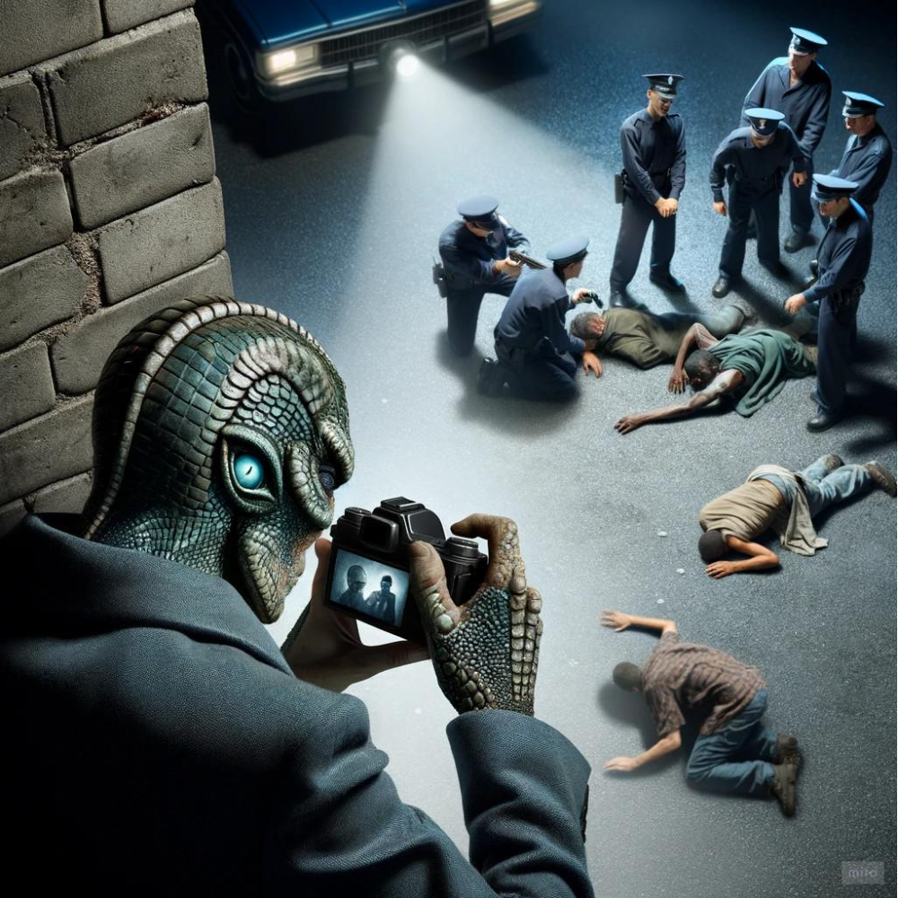
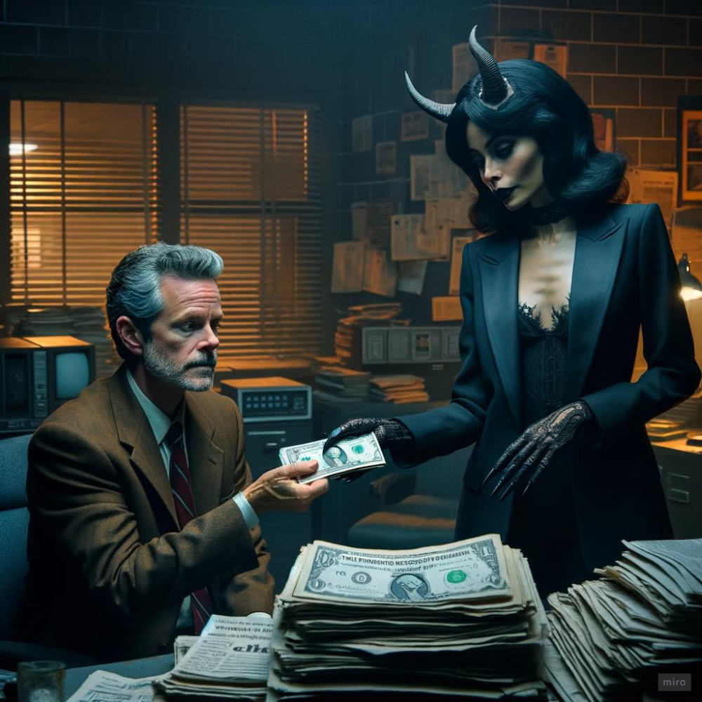
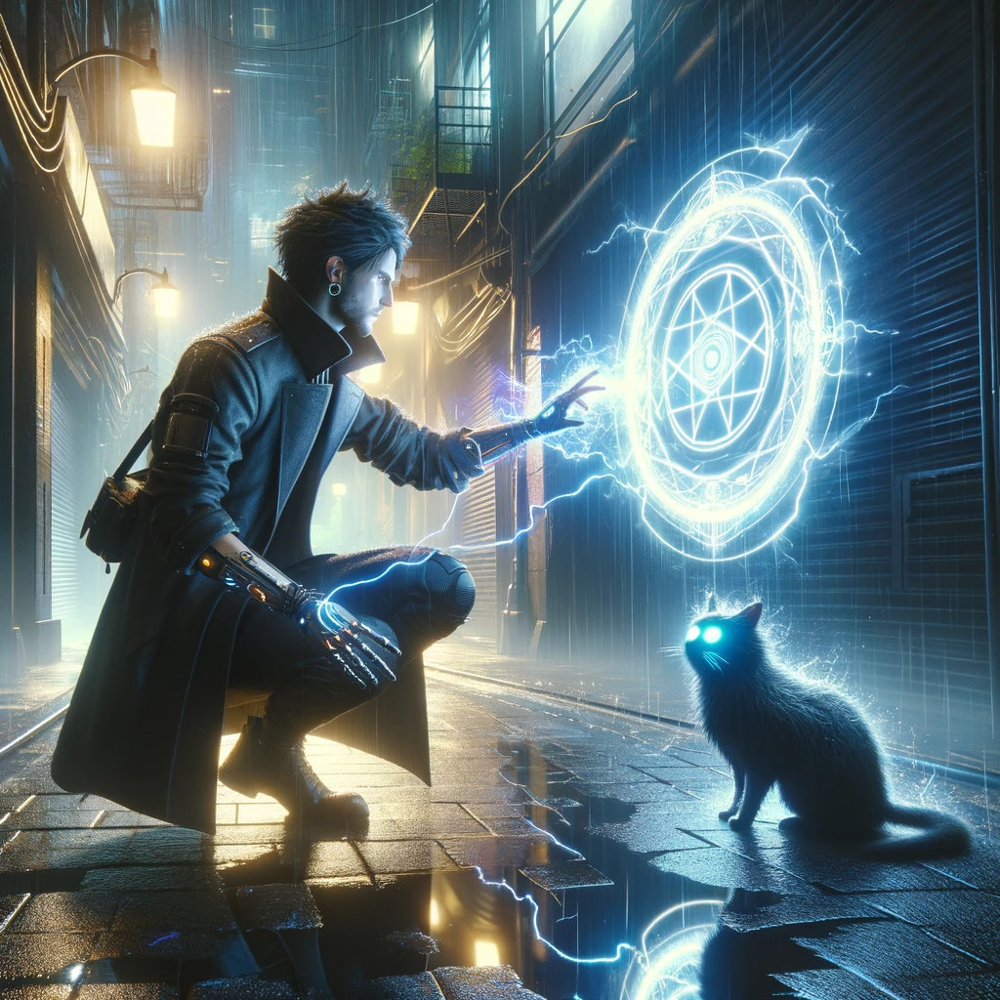
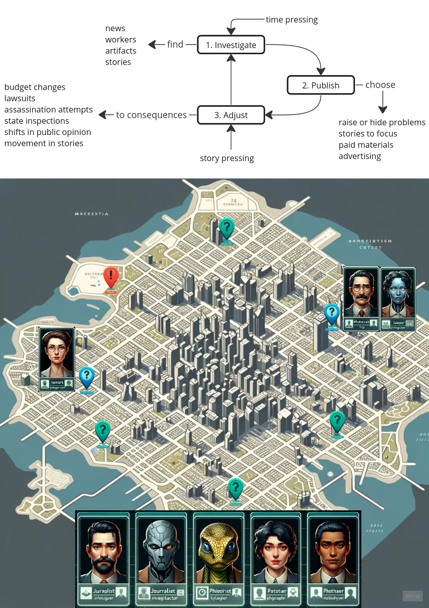

class: top

# Елецкий Алексей (Tiendil)

<!-- - Бэкграунд (с прошлой презы) -->

Занимаюсь разработкой ПО:

- программированием/лидством;
- всем остальным тоже, но чуть меньше;
- в основном бэкенд и геймдев.

Веду блог о разработке игр, мышлении и книгах.

Хочу делать собственные качественные продукты и зарабатывать на них деньги.

В программе потому что:

- хочу подтянуть скилы;
- она пересекается с моими интересами и планами;
- почему бы и нет — одну вселенную сделал, следующая выйдет лучше.

<!-- Написать 3 предложения о себе. "Занимаюсь/увлекаюсь [тем-то], когда вырасту хочу делать [то-то], в программе потому что [вот так вот]".   -->

---
class: top

# Other Side Universe

<!-- - Сеттинг (с прошлой презы) -->

The urban legends world with an open future which displays our fears, hopes, and fantasies in all their variety.

- A near future mystic sci-fi world.
- Science and paranormal are changing people and society.
- Free access to small-grade superpowers leads world to crisis of institutions and values.
- Government, media, secret organizations, and business clash over new power sources.

    
    
    

---
class: top

# Chief editor strategy

<!-- - Концепт продукта на основе исследования -->

Steam, single-player

Idea:

- Take role of the chief editor
- Direct everyday news flow into multiple channels
- Manipulate public opinion
- Support relations with powers
- Take action in stories of the city

Grounded:

- megalopolis "playground"
- simulated public opinion
- public opinion changes the city
- city parameters trigger stories
- more stories, less budjet
- 25 +- hired journalists
- few competitors

Optionally:

- Adapt agency to changes from 1990 (newspaper-era) to 2040 (ai/myth-era)

<!-- The best way to onboard sci-fi and mystery fans in his world is to create a tycoon/strategy game with strong rpg/story elements, where you have to manage the city newspaper, undertaking investigations of the mysteries and anomalies, making decisions to publish (or not) things you’ve uncovered, and dealing with the consequences in the form of legal, criminal, political, mystical and public pressure. Stories will introduce significant actors, and management will teach the rules of the world. -->

---
class: top

# Демо

- two channels
- abstract public like people in square
- flow of events -> react
- 3-5 investigators

<!-- - Описание демки, как мы её видим -->
