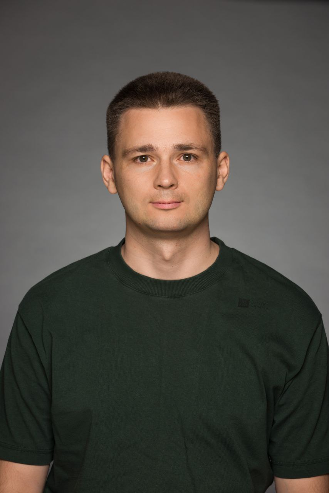

class: top

# Aliaksei Yaletski (Tiendil)

<!-- - Бэкграунд (с прошлой презы) -->

I am engaged in software development:

- Programming/leading;
- Everything else as well, but to a lesser extent;
- Mainly backend and game development.

I run a blog about game development, thinking, and books.

Blog: [tiendil.org](https://tiendil.org)

I want to create my own high-quality products and make money from them.

I am in this program because:

- I want to improve my skills;
- It aligns with my interests and plans;
- Why not? I've created one universe, the next one will be better.

---
class: top

# Other Side Universe

The urban legends world with an open future that displays our fears, hopes, and fantasies in all their variety.

- A near future mystic sci-fi world.
- Science and paranormal are changing people and society.
- Mass access to small-grade superpowers leads to a crisis of institutions and values.
- Government, media, secret organizations, and businesses clash over new power sources.

    
    
    

---
class: top

## Chief editor strategy

<!-- - Концепт продукта на основе исследования -->

- Steam, single-player
- Core & hardcore strategy players

Idea:

- Take the role of the chief editor
- Direct everyday news flow into multiple channels
- Manipulate public opinion
- Support relations with powers

Grounded:

- Megalopolis "playground"
- Simulated public opinion
- Public opinion changes the city
- City produces news
- More news & public opinion
- Less budget & office
- A team of 25± journalists
- Few competitors

---
class: top

## Potential big features/evolution directions

- "News director" system (Left 4 Dead, RimWorld)
- Complex news/story chains
- Longer historical period: from 1990 (newspaper-era) to 2040 (ai/myth-era)
- Single city ==> planet-scale simulation
- Multiplayer: small, massive.

---
class: top

# Demo

- no city map
- no competitors
- the city is represented by a crowd of people
- 2 news channels: classic newspaper and "Twitter"
- 3-5 predefined journalists
- 2-3 predefined power actors
- A predefined set of news with triggers
- goal: "win" of one of the power actors

Goal examples:

- Decide the future of wasteland: build a factory or a park
- Elections: support one of the candidates
- Provoke the lynching or prevent it

<!-- - Описание демки, как мы её видим -->
