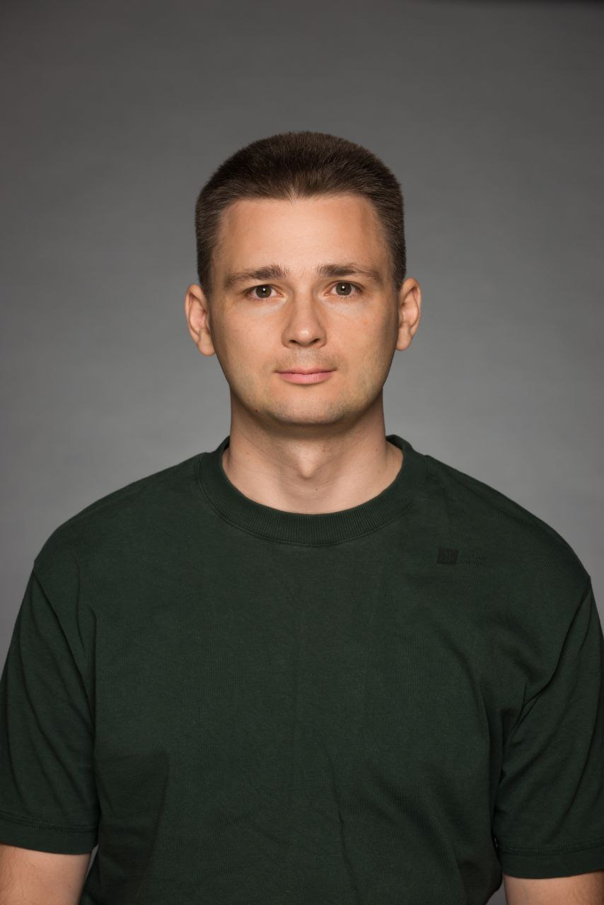

class: top

# Aliaksei Yaletski (Tiendil)

- Занимаюсь разработкой ПО:
  - программированием/лидством
  - всем остальным тоже, но чуть меньше
- Пишу блог о разработке игр, мышлении и книгах
- Хочу делать собственные полезные продукты и зарабатывать на них деньги
- В программе потому что хочу подтянуть скилы, она пересекается с моими интересами, одну IP уже сделал, почему бы не попробовать сделать круче.

---
class: top

# Other Side Universe

The urban legends world with an open future which displays our fears, hopes, and fantasies in all their variety

- our time
- Collective subconscious breaks into reality
- Science & Paranormal change people
- Civilization at a crossroads
- Slightly Hyperbolic Hate is deeper, friendship is stronger, hopes are brighter.

<!-- Слайд 2: Написать одно-два предложения про то самое за что мы бились на прошлой неделе "что за парк я строю и какой в нем главный аттракцион". "Я строю Sci-Fi вселенную в недалеком будущем, в которую из пространственно-временной аномалии постоянно валится всякая дичь".-->

---
class: top

# Путь идеи

1. Изначальная идея: нагенерировать идей и продуктов, итерационно выбрать лучшие
2. После фидбека объединил идеи в одну вселенную
3. Итерационно убрал лишнее, добавил нужное.
4. ????
5. Profit

<!-- Слайд 3: Написать несколько предложений о том как изменилась ваша идея или отношение к ней/взгляд на нее (или как идеи не было вообще) с начала программы до сегодняшнего дня. Если вы нихера не поняли, ничего не изменилось, или стало только хуже - это тоже результат. Не надо выдумывать успехи, мы не на заседании правительства. -->

---
class: top

# Тип медиа для первого продукта

Есть несколько вариантов, выбор будет сделан исходя из доступных ресурсов.

1. Социальные сети: crosslinked network of virtual persons/influencers from the Other Side Universe in popular social networks (TikTok, Instagram, Twitter, etc.) Монетизация через рекламу.
2. Игра, steam: менеджер новостного агентства, которое пишет про события в Other Side Universe
3. (веб?)Комиксы: истории из жизни персонажей Other Side, как возможность провести а/b тесты персонажей, сюжетов, ЦА. Чтобы на их основе делать больший продукт.

ПОЧЕМУ?

<!-- Слайд 4: Написать одно-два предложения о том в каком типе медиа хотите реализовывать эту вселенную (игра, кино, комикс и так далее) и почему. Возможно, есть какие-то аспекты вселенной, которые прямо просятся на реализацию в каком-то типе медиа (типа важная идея вашей вселенной выглядит как готовая игровая механика). -->

---
class: top

# Запомнилось/Feedback

<figure>
  <blockquote>
    <ul>
<li>…мне пока не хватает глубины и бизнес-аспектов…</li>
<li>…у насмотренных контентом людей правда есть небанальные идеи и глубина проектов, на которую они смотрят.</li>
</ul>
</blockquote>
<figcaption>Oles</figcaption>
</figure>

<ul>
<li>систематическое невлезание занятий в тайминги</li>
<li>позитивное — использование категориального анализа как интструмента.</li>
</ul>

<!-- Слайд 5: -->
<!--   5.1. Спрашиваете любого из участников "расскажи мне пжлст любое, что вообще запомнилось (хорошее, плохое, смешное, неожиданное) за прошедшее время на программе. От стикера в чате, до гениальной идеи в вашем же проекте или в обсуждении, или какой-то новой информации про вас самих, про других участников, про программу, про меня (ИЛИ ПОЛЯКОВА). Помещаете ответ на слайд. -->
<!--   5.2. Спрашиваете то же самое у себя. Помещаете ответ на слайд. -->

<!-- Презенташку лучше всего сделать в Google Slides и прилепить ссылку на нее в своей строке в той табличке, которую вы собрали в прошлую субботу -->
